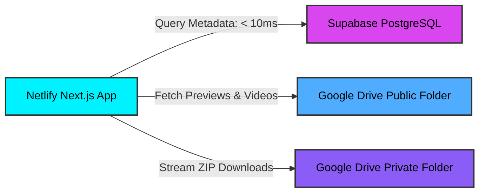

# Project Plan: Interactive Ambigram Sharing & Showcase Platform

This plan outlines the finalized architecture, design, security, and step-by-step implementation for your personal ambigram sharing and showcase website.

---

## 📐 1. Core Architecture & Tech Stack

To manage admin uploads, secure asset downloading, and high-performance interactive visitor pages in a single codebase with zero hosting fees and 15GB+ (or your existing Google Drive plan storage) of media storage:

* **Framework**: **Next.js (App Router)** - Unifies pages, interactive components, and secure backend API endpoints in one project.
* **Hosting**: **Netlify (Free Tier)** - Deploys the frontend and serverless API endpoints directly from your GitHub repo.
* **Database**: **Supabase PostgreSQL (Free Tier)** - Provides a hosted Postgres database. Queries are lightning-fast (<10ms), serverless-compatible, and the free 500MB database tier can store metadata for over 100,000 designs.
* **File Storage**: **Google Drive API** - Connects securely to your Google Drive to store preview images, timelapse videos, and source ZIP files.
* **Styling**: **Vanilla CSS Modules** - Lightweight, zero-dependency styling for custom glassmorphism interfaces and fluid 3D animations.
* **Helper CLI Tool**: **FFmpeg Local CLI script** - Automatically handles local speed-up, resizing, compression, and audio-stripping for your timelapse recordings before you upload them.

---

## 🔒 2. Privacy, Access, & Sharing Modes

We support two distinct content types to separate custom commissions/gifts from general showcase art:

### Mode A: Shareable Ambigram (Private or Public Link)
* **Goal**: Intended for a specific recipient or as a stand-alone sharable design.
* **Direct Route**: Access via a short, unguessable 8-character random alphanumeric URL (e.g., `/ambigram/xT9kR3w2`).
* **Features**: Displays the interactive viewer, optional recipient name, drawing timelapse, and a **password-protected download button** for source files (SVG/ZIP).
* **Showcase Visibility**: Can optionally be made public to display in the showcase grid too.

### Mode B: Showcase-Only Ambigram
* **Goal**: General artwork uploaded strictly to display in the public showcase gallery.
* **Access**: Can **only** be viewed inside the interactive preview modal on the Showcase Grid.
* **No Direct Route**: Does not generate a shareable URL; accessing `/ambigram/[id]` directly for this design returns a `404 Not Found` or redirects to the showcase.
* **No Downloads**: Has no recipient, no source asset zip, and no download options.

---

## 🛡️ 3. Security Architecture & Google Drive Isolation

Protecting your personal files is our highest priority. The system is designed with cryptographic isolation using Google Cloud IAM (Identity and Access Management).

```
[ Your Personal Google Drive (5TB) ]
  ├── 📂 Tax Documents (Private - NO Access)
  ├── 📂 Personal Photos (Private - NO Access)
  └── 📂 Ambigram Project Root <=================[ SHARED ONLY ]
        │                                                ▲
        └── (Service Account Credentials JSON) ──────────┘
```

### Why Your Personal Files Are 100% Safe:
1. **Cryptographic Sandboxing (No Default Access)**: 
   * A Google Service Account is treated by Google as a completely separate, virtual user. By default, it has access to **nothing** in your personal Google Drive.
   * It is impossible for the Service Account to browse, list, edit, or delete any files in your personal Google Drive **unless you explicitly click the Google Drive "Share" button on a folder and invite the service account's email.**
2. **Access Scope Restriction**:
   * Even if a malicious actor hacked the Netlify servers and stole your Service Account JSON Key, **they could only see and access files inside the specific folder you shared with it**. The rest of your 5TB Google Drive remains invisible and completely inaccessible to them.
3. **Environment Isolation**:
   * The private JSON credential key is stored in Netlify's backend environment variables. It is encrypted at rest and never compiled into frontend client code.
   * All Google Drive calls are executed in Serverless API endpoints on the server side (`use server`), ensuring that the browser never gets exposed to authentication secrets.

---

## 🎬 4. Video Post-Processing (FFmpeg CLI Utility)

To handle raw, heavy video screen recordings (e.g. 30 minutes of Procreate drawing), we will create a simple local command-line script `compress_timelapse.sh` inside your project folder. 

Before uploading via the admin page, you run the script to process the video locally on your machine:
```bash
./compress_timelapse.sh input.mp4 output.mp4 [speed_factor]
```

### What the FFmpeg Script Does:
1. **Speed-Up (Timelapse effect)**: Accelerates the footage (e.g. $10\times$ speed multiplier) using FFmpeg's video filter: `-vf "setpts=0.1*PTS"`.
2. **Audio Stripping**: Strips the soundtrack (drawing recordings have no audio), which dramatically reduces video file size: `-an`.
3. **Optimized Compression (H.264)**: Compresses the video using H.264 codec with a Constant Rate Factor (CRF) of 26: `-c:v libx264 -crf 26 -preset fast`.
4. **Resolution Scaling**: Scales the video to a web-optimized 1080p resolution while maintaining the aspect ratio: `-vf "scale=1920:-2"`.

This reduces a **200MB raw video** down to a **5MB–10MB web-optimized file** that loads instantly on mobile screens.

---

## 📁 5. Google Drive Folder & Access Structure

To store files securely, your Google Drive root folder contains a dedicated folder structure. 

```
📁 Ambigram Project Root (Shared privately with the Service Account as Editor)
 ├── 📁 Previews (Subfolder - Shared as "Anyone with link can view - Viewer")
 ├── 📁 Timelapses (Subfolder - Shared as "Anyone with link can view - Viewer")
 └── 📁 Secure Assets (Subfolder - Restricted/Private)
```

### Folder Access Details:

| Asset Location | Directory Path / File | Sharing Permission (Google Drive) | Web Application Access Flow |
| :--- | :--- | :--- | :--- |
| **Previews** | `/Previews/` | **Anyone with link can view**<br>(Shared as *Viewer*) | Images (WebP/PNG) are rendered on the page using direct CDN/embed URLs (e.g., `https://docs.google.com/uc?export=view&id=[FileID]`). This offloads bandwidth from Netlify. |
| **Timelapses** | `/Timelapses/` | **Anyone with link can view**<br>(Shared as *Viewer*) | Timelapse videos (MP4/GIF) play directly inside the HTML5 video player using direct Google Drive preview links. |
| **Secure Assets** | `/Secure Assets/` | **Restricted / Private**<br>(Shared only with Service Account as *Editor*) | Holds original SVGs and vector ZIP files. The public has **no** direct access to this folder. When a visitor inputs the correct password, the Next.js API fetches the file using the Service Account and streams the file to the browser, hiding the Google Drive URL. |

---

## 🎨 6. UI/UX & Page Layouts

A dark, immersive theme optimized for showing off calligraphic work:

* **Theme**: Deep obsidian backgrounds (`#080A10`), translucent cards with heavy blurs (glassmorphism), and thin glowing cyan/violet borders.
* **Public Showcase Grid (`/` or `/showcase`) [Multi-Item Gallery]**:
  * Displays a responsive gallery grid of all public ambigrams (both Showcase-Only and public Shareable entries).
  * **Modal View**: Clicking any card opens the interactive rotation card and timelapse player in a glassmorphic modal overlay, retaining the scroll position.
  * **No Downloads**: The modal disables and hides all download buttons, protecting showcase art.
* **Direct Visitor Page (`/ambigram/[id]`) [Single-Item Shareable View]**:
  * Dedicated, full-screen presentation page accessible **only** for Shareable-mode designs.
  * Houses the password-protected source asset download gateway.

---

## 📝 7. Database Schema (Supabase PostgreSQL)

All columns except the title and preview image are nullable to support showcase-only uploads and custom configurations.

```sql
CREATE TABLE ambigrams (
  id VARCHAR(8) PRIMARY KEY,          -- 8-character random string (primary key)
  title VARCHAR(255) NOT NULL,       -- Title of the design
  description TEXT,                  -- Optional description/notes (nullable)
  recipient_name VARCHAR(255),       -- Optional recipient (nullable, blank for Showcase-Only)
  preview_drive_id TEXT NOT NULL,    -- Google Drive File ID of the WebP preview image
  timelapse_drive_id TEXT,           -- Google Drive File ID of the timelapse video (nullable)
  assets_drive_id TEXT,              -- Google Drive File ID of the secure ZIP package (nullable)
  download_password_hash TEXT,       -- Hashed download password (nullable, blank for Showcase-Only)
  is_public INTEGER DEFAULT 0,       -- 1 = show in showcase gallery grid, 0 = private link only
  is_shareable INTEGER DEFAULT 1,    -- 1 = generates direct /ambigram/[id] route, 0 = showcase-only modal view
  created_at TIMESTAMP DEFAULT CURRENT_TIMESTAMP
);
```

---

## 🌐 8. Deployment & Hosting Strategy



* **Frontend Hosting**: Hosted on **Netlify** (linked to your GitHub repository for continuous deployment).
* **Database Queries**: Supabase PostgreSQL handles metadata fetches. It is extremely fast and has no cold starts or caching latency issues.
* **File Storage**: Google Drive API stores all preview images, videos, and source ZIP files. The files are securely managed via a Google Cloud Service Account.

---

## 🚀 9. Implementation Steps

1. **Google Cloud Console Setup**:
   * Create a Google Cloud Project and enable the **Google Drive API**.
   * Create a Service Account, download the JSON private key, and share your Drive folders with the service account email.
2. **Supabase Setup**:
   * Create a free Supabase project.
   * Run the SQL migration query to create the `ambigrams` table.
3. **Project Setup**: Initialize the Next.js project and install the official `@supabase/supabase-js` and `googleapis` SDK packages. Add the local `compress_timelapse.sh` script.
4. **Admin Panel (`/admin`)**: Build a secure upload portal. The backend endpoint uploads files to their respective Google Drive folders, and inserts the generated metadata row (including file IDs) into your Supabase database.
5. **Interactive Shared Page (`/ambigram/[id]`)**: Build the direct view. The download endpoint validates the password, fetches the zip from the private `/Secure Assets/` folder, and streams it to the user.
6. **Showcase Gallery Grid (`/`)**: Build the public gallery with a modal preview viewer (downloads disabled).
7. **Netlify Deployment**: Configure environment variables (`SUPABASE_URL`, `SUPABASE_SERVICE_ROLE_KEY`, `GOOGLE_SERVICE_ACCOUNT_KEY`, `ADMIN_PASSWORD`) on Netlify and deploy.
